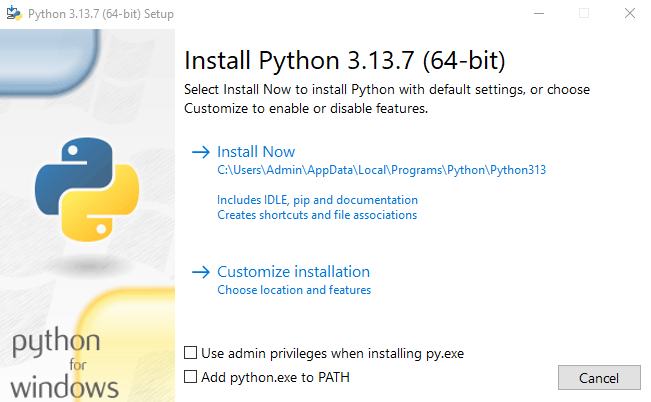
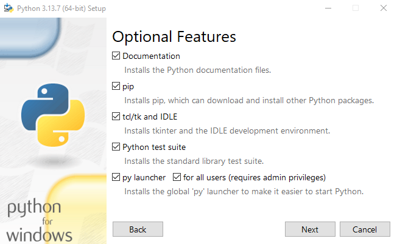
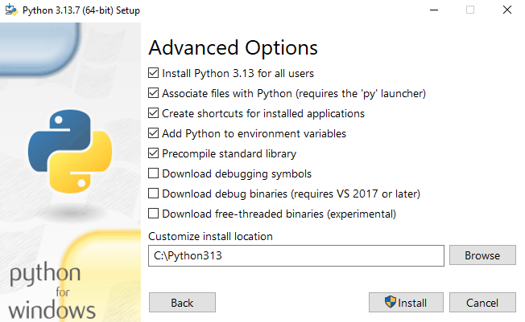
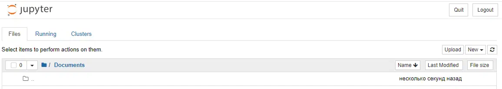
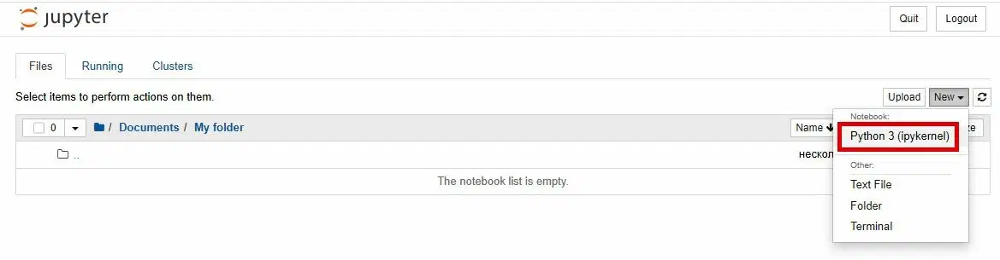

Введение в Python
=================

### Настройка рабочего места

### Установка Python

#### Установка в Windows:

Для начала проверить, какая версия Windows на компьютере — 32-битная или 64-битная. Это будет указано в строке «Тип системы» на странице «Сведения о системе». Чтобы попасть туда, попробуйте один из этих способов:

Нажать одновременно клавиши Windows и Pause/Break

Открыть панель управления из меню Windows, оттуда перейти в «Система и безопасность», затем в «Система»

Нажать клавишу Windows, затем перейти по разделам _Настройки > Система > О системе_

Можно загрузить Python для Windows с официального веб-сайта:
[https://www.python.org/downloads/windows/](https://www.python.org/downloads/windows/).

Перейти по ссылке «Latest Python 3 Release - Python x.x.x». Если установлена 64-битная версия Windows, скачать Windows installer (64-bit). Если нет — скачать Windows installer (32-bit). После загрузки дистрибутива запустить его (двойным щелчком) и следовать инструкциям.

Обратите внимание на экран мастера установки, который называется «Setup» (Настройка): нужно пролистать его вниз и выбрать опцию «Add Python.exe to the PATH» (Добавить Python.exe к системной переменной PATH):


<hr>

<hr>



_Примечание:_ если используется старая версия Windows (7, Vista или ещё более старую версия), и установка Python 3.13 завершается выводом сообщения об ошибке, можно попробовать:

либо установить все доступные обновления Windows и попробовать установить Python 3.13 заново;

либо установить [более раннюю версию Python](https://www.python.org/downloads/windows/), например, [3.8.10](https://www.python.org/downloads/release/python-3810/).

#### Установка в Linux:

Вполне вероятно, что уже установлен Python. Чтобы проверить это (а также версию языка), откройте консоль и введи следующую команду:

```
python3 --version 
Python 3.12.3
```

Если установлена другая версия Python, не меньше чем 3.9 (например, 3.9.19), то нет необходимости обновляться.

Если Python не установлен, то можно установить его следующим образом:
```
sudo apt install python3
```


Убедитесь, что установка прошла успешно, открыв приложение Терминал и запустив команду:

```
python3 --version 
Python 3.12.3
```


### Jupyter Notebook

#### Установка

Нужно перейти в командную строку и установить сам ноутбук. В этом поможет специальная утилита — pip. С помощью неё можно распаковать, установить или обновить программы, в том числе и Jupyter. Утилита загружается на компьютер вместе с Python. Чтобы установить ноутбук, надо ввести команду:

```
pip install notebook
```


Если выводится сообщение `Successfully installed`, то Jupyter-ноутбук готов к запуску. Чтобы начать работу, используют команду

```
jupyter notebook
```


#### Основы работы

В Jupyter Notebook две основные части: веб-приложение и ноутбуки ― файлы, в которых работают с исходным кодом программы, запускают его и выводят данные в разных форматах. Для экспорта ноутбуков используют два формата ― PDF и HTML.

Что можно делать в веб-приложении:

- запускать и редактировать код в браузере;

- показывать результаты расчётов, используя схемы и графики;

- использовать язык разметки Markdown и LaTeX.

Интерфейс ноутбука открывается прямо в браузере



Чтобы начать новый проект, нужно запустить Jupyter-ноутбук и создать папку для проектов. Затем нажать New в правой части экрана и выбрать в списке меню Folder.

Новая папка автоматически будет названа Untitled folder. Чтобы назвать её по-другому, нужно поставить галочку напротив имени и нажать Rename Чтобы создать ноутбук, нужно снова использовать New и выбрать Python 3.


