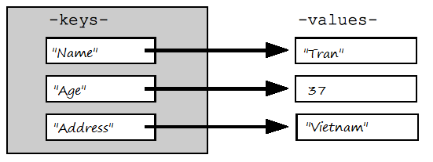

Типы данных
===========

### Числа

Математика в Python

```python
import math print(math.pi)
print(math.cos(math.pi))
print(math.exp(10))
print(math.log10(1000))
print(math.sinh(1))
print(math.factorial(6))

Результат:
3.141592653589793
-1.0
22026.465794806718
3.0
1.1752011936438014
720
```

Упражнение:

Иногда математика в Python может вас удивить. Например, возьмем два float числа `1.1` и `2.2`, по логике мы же понимаем, что результатом их сложения будет `3.3`. Python с нами в этом плане не согласен.

```python
(1.1 + 2.2) == 3.3
False
```
Почему?

Упражнение:

Найти день недели для заданной даты

Дано:  
`given_date = datetime(2020, 7, 26)`  
Ожидаемый результат:  
`Sunday`  
Примерное решение:  

```python
from datetime import datetime

# получаем день недели как целое число
given_date = datetime(2020, 7, 26)
# Получаем английское название дня недели
print(given_date.today().weekday()) 
print(given_date.strftime('%A'))
```

### Строки

Упражнение:

Палиндром

Примерное решение:

```
my_str = 'мадам'
my_str = my_str.casefold()
rev_str = reversed(my_str)
if list(my_str) == list(rev_str):
    print("Строка является палиндромом")
else:
    print("Строка не является палиндромом")
```

Упражнение:

Удалить знаки препинания

Примерное решение:

```python
punctuations = '''!()-[]{};:'"\,<>./?@#$%^&*_~'''
my_str = "Привет!!!, Меня зовут ---Алексей."


# my_str = input("Введи строку ")
no_punct = ""
for char in my_str:
   if char not in punctuations:
       no_punct = no_punct + char

print(no_punct)
```


### Время и даты

[Python дата и время](https://pydocs.ru/python-data-i-vremya/)

Упражнение:  
Найти день недели для заданной даты  
Дано:  
`given_date = datetime(2020, 7, 26)`  

Ожидаемый результат:  
`Sunday`

Примерное решение:
```python
from datetime import datetime

given_date = datetime(2020, 7, 26)

# получаем день недели как целое число
print(given_date.today().weekday())
# Получаем английское название дня недели
print(given_date.strftime('%A'))
```

Упражнение:  

Вычислить количество дней между двумя заданными датами  

Дано:  
```python
# 2020-02-25
date_1 = datetime(2020, 2, 25)

# 2020-09-17
date_2 = datetime(2020, 9, 17)
```

Ожидаемый результат:
```
205 days
```
Примерное решение:

```python
from datetime import datetime

# 2020-02-25
date_1 = datetime(2020, 2, 25).date()

# 2020-09-17
date_2 = datetime(2020, 9, 17).date()

delta = None

if date_1 > date_2:
    print("date_1 is greater")
    delta = date_1 - date_2
else:
    print("date_2 is greater")
    delta = date_2 - date_1

print("Difference is", delta.days, "days")

```

### Кортежи, множества

### Словари



```python
d1 = dict()
d2 = {}
d1 = {
'key1': 'value1',
'key2': 10
}
d1
Out: {'key1': 'value1', 'key2': 10}

d1['key3'] = 'test'
d1
Out: {'key1': 'value1', 'key2': 10, 'key3': 'test'}

d1['key3']
Out: 'test'

del d1['key3']
d1
Out: {'key1': 'value1', 'key2': 10}

d1.items()
Out: dict_items([('key1', 'value1'), ('key2', 10)])

d1.keys()
Out: dict_keys(['key1', 'key2'])

d1.values()
Out: dict_values(['value1', 10])
```